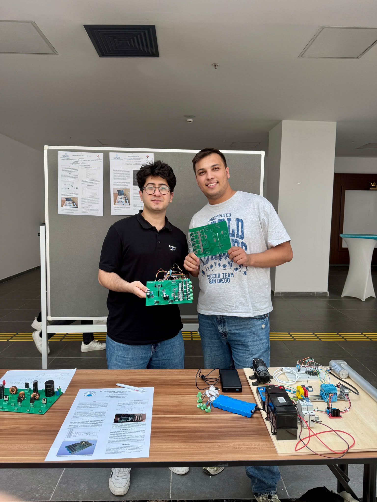
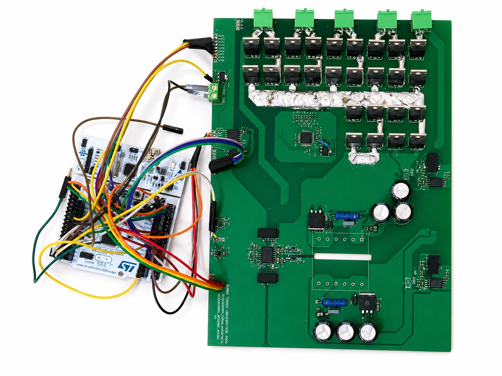
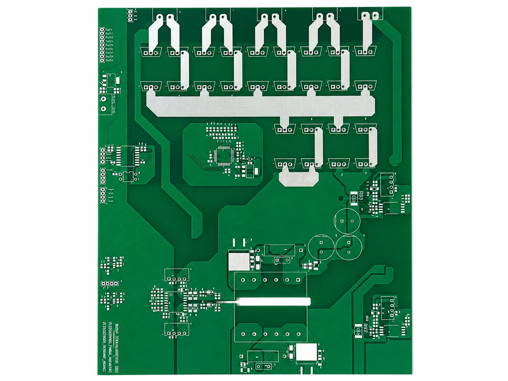
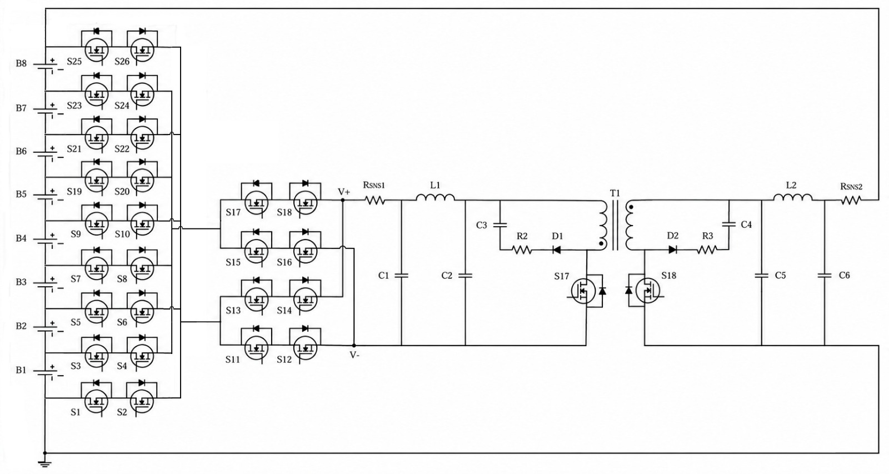
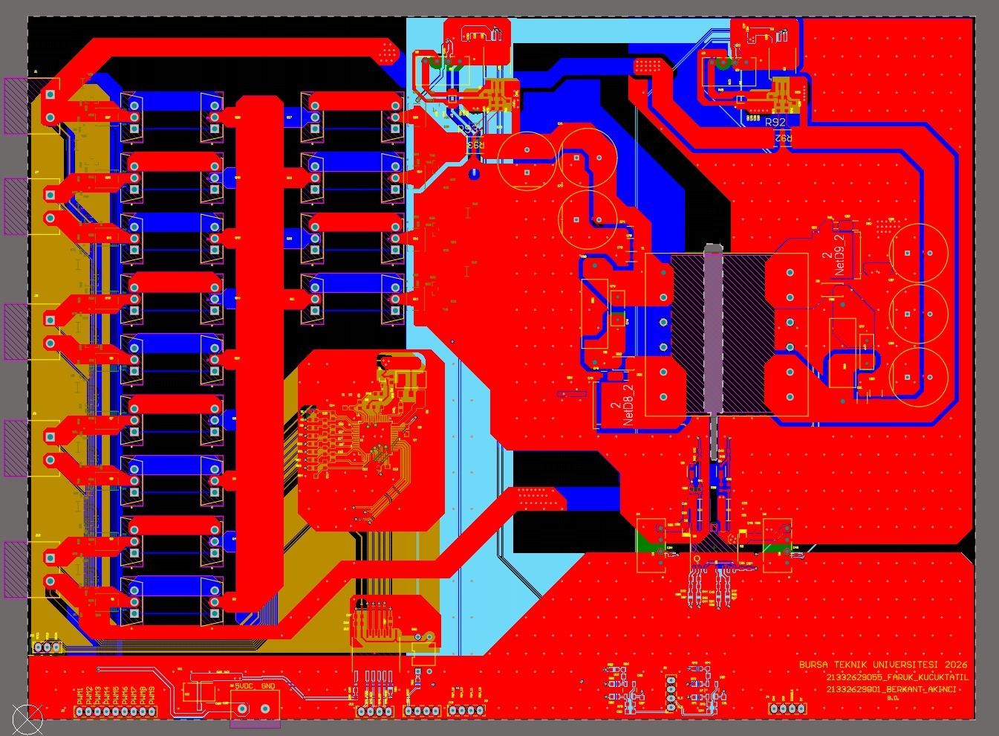
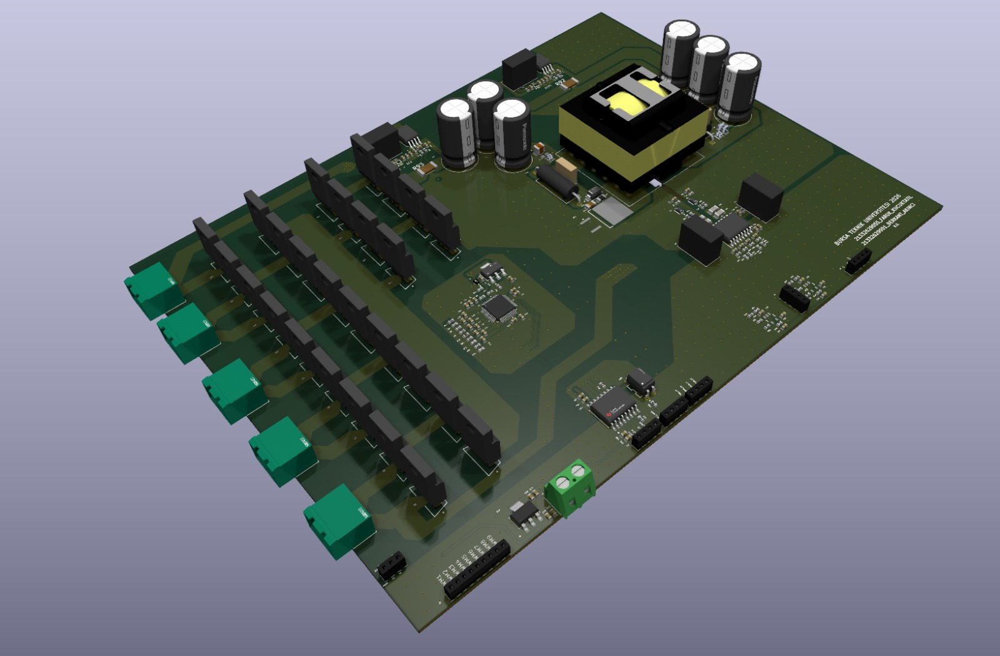
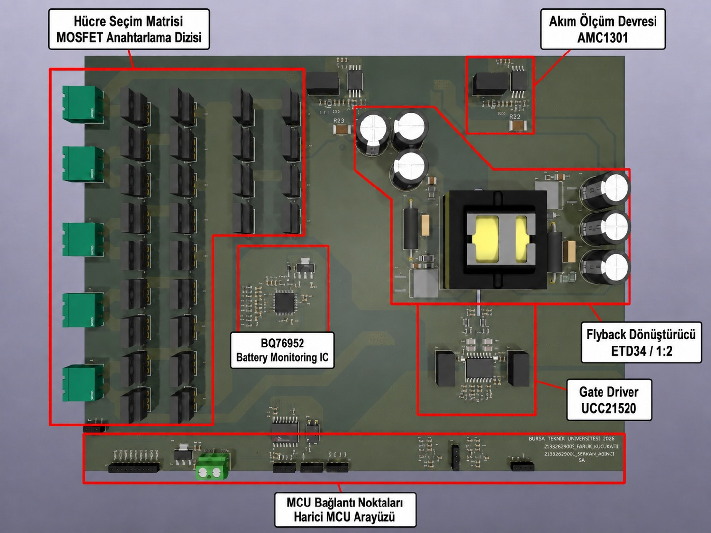
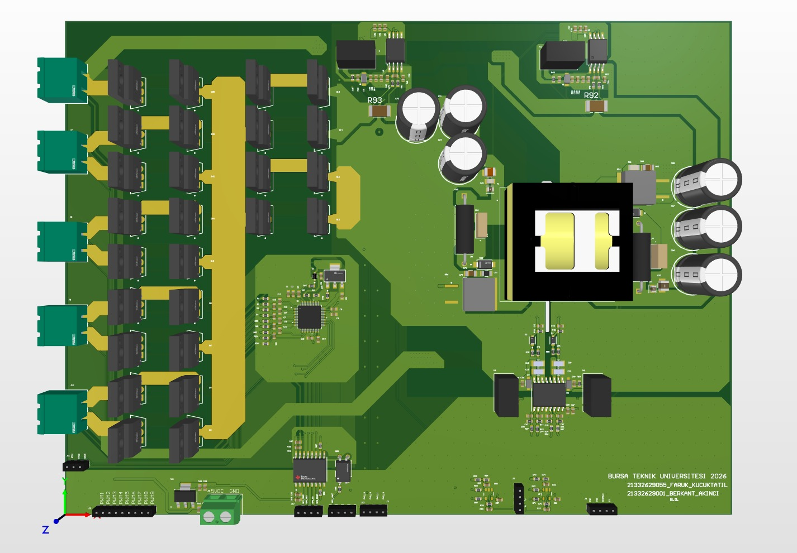

# 8S Li-ion Active Balancing System Based on Flyback Converter

This repository contains our undergraduate graduation thesis on the design of a **flyback converter based bidirectional active balancing system** for **8-cell Li-ion battery packs**.

## Project Title

**Design of a Flyback Converter Based Active Balancing System for Bidirectional Energy Transfer in 8-Cell Li-ion Battery Packs**

**Türkçe Başlık:**  
**8 Hücreli Li-ion Batarya Paketlerinde Çift Yönlü Enerji Aktarımı için Flyback Dönüştürücü Tabanlı Aktif Dengeleme Sistemi Tasarımı**

## Authors

- Faruk Küçüktatıl  
- Berkant Akıncı  

## Advisor

- Assoc. Prof. Dr. Davut Ertekin

## University

Bursa Technical University  
Faculty of Engineering and Natural Sciences  
Department of Electrical and Electronics Engineering  

## Project Overview

In this graduation project, a flyback converter based bidirectional active balancing system was designed for an 8-series Li-ion battery pack.

The main purpose of the project is to reduce voltage imbalance between cells in multi-cell Li-ion battery packs. Instead of dissipating excess energy as heat, the proposed active balancing structure aims to transfer energy between the selected cell and the battery pack.

The system supports two main operating modes:

- **Cell-to-Pack (CTP):** Energy transfer from a high-voltage cell to the battery pack
- **Pack-to-Cell (PTC):** Energy transfer from the battery pack to a low-voltage cell

## Main Project Topics

- Battery Management System (BMS)
- Active cell balancing
- Flyback converter design
- Bidirectional energy transfer
- MOSFET-based cell selection matrix
- STM32-based control approach
- MATLAB/Simulink simulation studies
- 4-layer PCB design
- Current and voltage sensing approach
- Gate driver and snubber circuit design

## Hardware Design

The hardware design includes a 4-layer PCB structure developed for the active balancing system. The main hardware blocks are:

- Flyback converter power stage
- MOSFET-based cell selection matrix
- Gate driver circuits
- Snubber and protection structures
- Current and voltage sensing points
- STM32 Nucleo based control interface
- 8S Li-ion battery pack connection structure

## Simulation

The system was modeled and analyzed in MATLAB/Simulink. Both Cell-to-Pack and Pack-to-Cell operating modes were evaluated using current and voltage waveforms.

The simulation studies were used to observe:

- Primary and secondary current behavior
- Bidirectional energy transfer
- Cell balancing current
- MOSFET switching behavior
- Discontinuous Conduction Mode (DCM) operation

## Thesis Document

The full thesis document can be accessed from the repository files.

[View Thesis PDF](./8S-Liion-Active-Balancing-Flyback-Converter-Thesis.pdf)

## Project Images

### Project Presentation Photo

### Assembled PCB and STM32 Test Setup

### Fabricated PCB Front View

### System Schematic

### 2D PCB Top View

### 3D PCB Isometric Render

### 3D PCB Isometric Render - Alternative View

### 3D PCB Top View

## Keywords

Battery Management System, BMS, Active Balancing, Flyback Converter, Bidirectional Energy Transfer, Power Electronics, Embedded Systems, STM32, PCB Design, MATLAB, Simulink

## Notes

This project was completed as an undergraduate graduation thesis at Bursa Technical University, Department of Electrical and Electronics Engineering.

The physical verification of the flyback transformer and full power-stage experimental tests were planned as future work. Therefore, the system behavior was mainly evaluated through theoretical calculations, PCB design, and MATLAB/Simulink simulation results.

## License

This repository is shared for educational and academic purposes.
